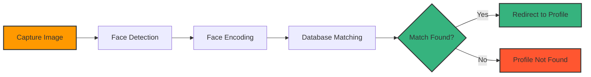
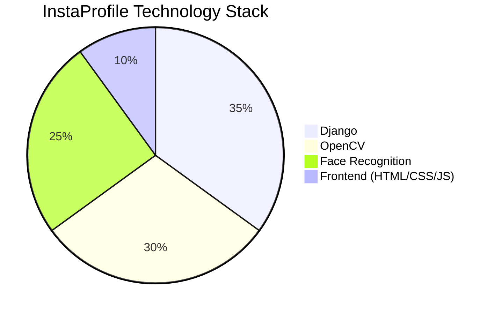
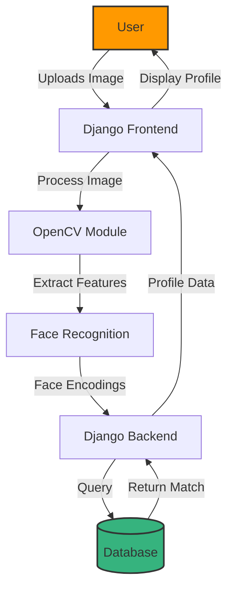
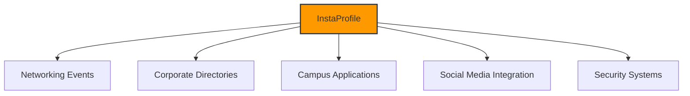

# InstaProfile 

<div align="center">


  ### 👤 Facial Recognition Profile Discovery Platform
  
  <p>Scan faces to instantly access profiles with our powerful Django-based facial recognition system</p>

  [](https://www.djangoproject.com/)
  [](https://www.python.org/)
  [](https://opencv.org/)
  [](LICENSE)
  
</div>

## 🔍 How It Works

<div align="center">



</div>

## ✨ Features

<table>
  <tr>
    <td width="50%">
      <h3>🔍 Real-time Face Recognition</h3>
      <ul>
        <li>Instant face detection and analysis</li>
        <li>High accuracy matching algorithm</li>
        <li>Works with various lighting conditions</li>
      </ul>
    </td>
    <td width="50%">
      <h3>👤 Profile Management</h3>
      <ul>
        <li>Customizable user profiles</li>
        <li>Multiple face encodings per profile</li>
        <li>Privacy settings and controls</li>
      </ul>
    </td>
  </tr>
  <tr>
    <td width="50%">
      <h3>📱 Mobile Compatibility</h3>
      <ul>
        <li>Responsive design for all devices</li>
        <li>Camera access on mobile browsers</li>
        <li>Progressive web app capabilities</li>
      </ul>
    </td>
    <td width="50%">
      <h3>🔒 Security Focused</h3>
      <ul>
        <li>Encrypted facial data storage</li>
        <li>Consent-based recognition</li>
        <li>GDPR compliant implementation</li>
      </ul>
    </td>
  </tr>
</table>

## 📊 Technology Distribution

<div align="center">



</div>

## 🚀 Quick Start

```bash
# Clone repository
git clone https://github.com/yourusername/instaprofile.git
cd instaprofile

# Setup environment
python -m venv venv
source venv/bin/activate  # On Windows: venv\Scripts\activate
pip install -r requirements.txt

# Install additional dependencies
pip install opencv-python face-recognition dlib

# Initialize application
python manage.py migrate
python manage.py createsuperuser
python manage.py runserver

# Access at http://127.0.0.1:8000/
```

## 📋 Requirements

- Python 3.8+
- Django 4.0+
- OpenCV 4.5+
- face_recognition library
- dlib
- Webcam or camera access for face scanning


## 🛠️ System Architecture

<div align="center">



</div>

## 🔄 Face Recognition Process

<table>
  <tr>
    <th>Step</th>
    <th>Description</th>
    <th>Technology</th>
  </tr>
  <tr>
    <td>1. Face Detection</td>
    <td>Locate and isolate faces in the image</td>
    <td>OpenCV / HOG detector</td>
  </tr>
  <tr>
    <td>2. Face Alignment</td>
    <td>Normalize face position and orientation</td>
    <td>dlib</td>
  </tr>
  <tr>
    <td>3. Feature Extraction</td>
    <td>Extract 128-dimensional face encoding</td>
    <td>face_recognition</td>
  </tr>
  <tr>
    <td>4. Database Matching</td>
    <td>Compare encoding with stored profiles</td>
    <td>Django ORM / NumPy</td>
  </tr>
  <tr>
    <td>5. Profile Retrieval</td>
    <td>Fetch matching profile information</td>
    <td>Django</td>
  </tr>
</table>

## 🔐 Privacy & Security

InstaProfile takes privacy seriously. Our implementation includes:

- **Opt-in only**: Users must explicitly consent to facial recognition
- **Data encryption**: All facial encodings are encrypted at rest
- **Limited data storage**: Only facial encodings are stored, not raw images
- **Deletion options**: Users can delete their facial data at any time
- **Access controls**: Strict permission system for profile access

## 🧩 Use Cases

<div align="center">



</div>

## 👨‍💻 Contributing

Contributions are welcome! We're particularly interested in:

- Improving recognition accuracy
- Adding support for more platforms
- Enhancing security features
- Optimizing performance

<details>
<summary>Click to expand contribution guidelines</summary>

1. Fork the project
2. Create your feature branch (`git checkout -b feature/amazing-feature`)
3. Commit your changes (`git commit -m 'Add some amazing feature'`)
4. Push to the branch (`git push origin feature/amazing-feature`)
5. Open a Pull Request

Please ensure your code follows our coding standards and includes appropriate tests.
</details>

## 📜 License

Distributed under the MIT License. See [LICENSE](LICENSE) for more information.

## 📞 Contact & Support

<div align="center">
  
[](mailto:vendotha@gmail.com)
[](https://github.com/vendotha/instaprofile/issues)


</div>

---

<div align="center">
  <sub>Built with computer vision and web technology by Bhuvan Vendotha</sub>
  
  ⭐ Star this repo if you find it useful! ⭐
</div>
